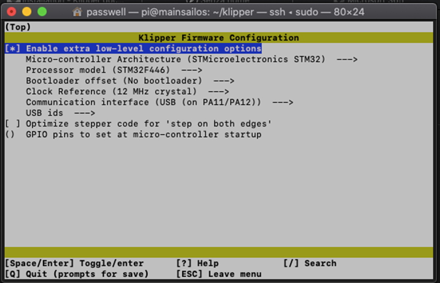
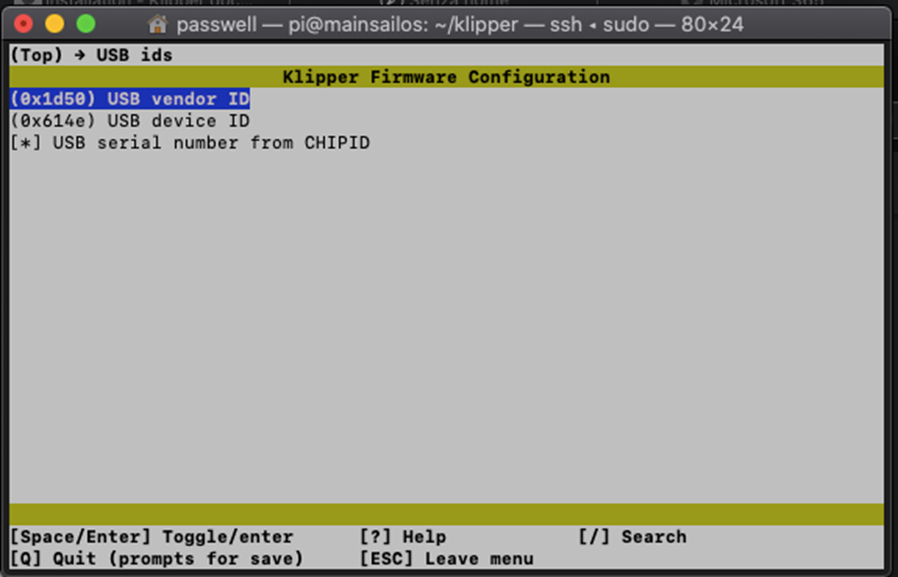
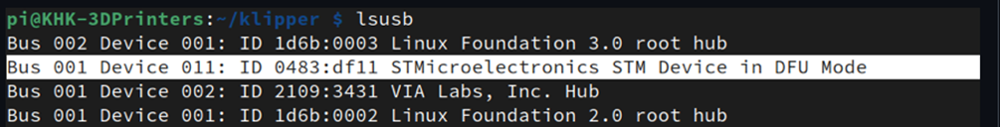
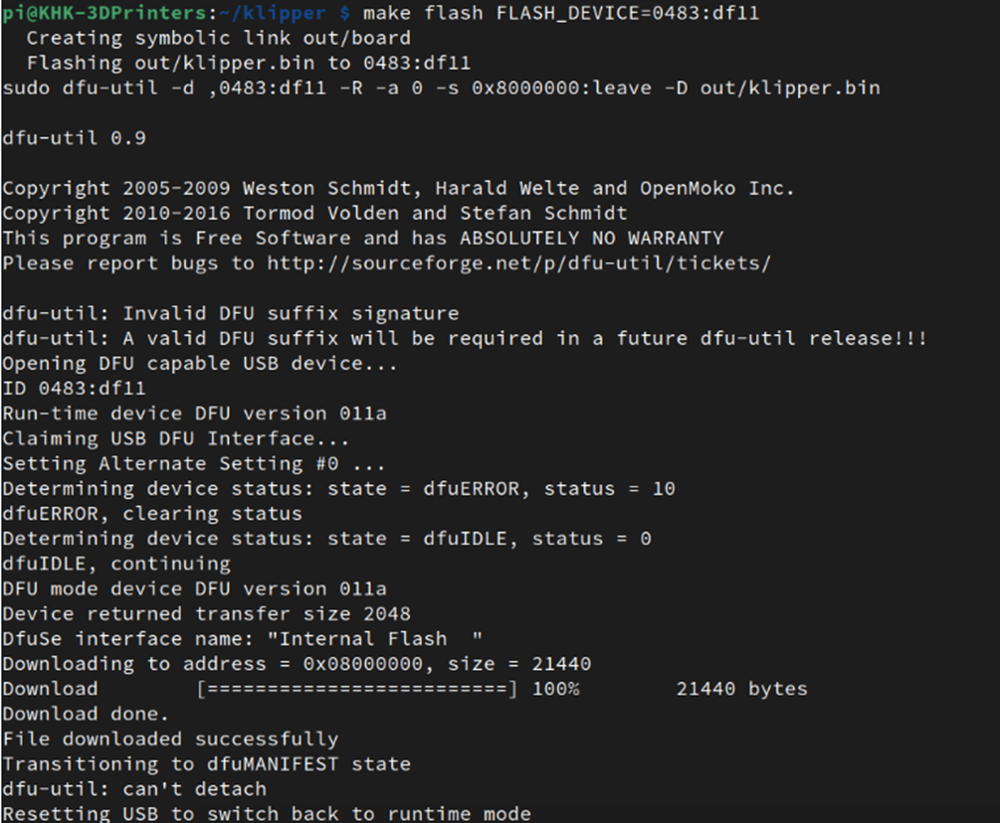
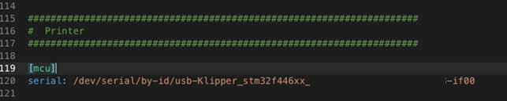

# Manuale Aggiornamento Firmware MKS Rumba32 a Klipper 🔧🖥️

Le istruzioni aggiornate per GitHub forniscono una guida chiara e sequenziale per compilare e flashare il firmware Klipper sulla MKS Rumba32 tramite Raspberry Pi in modalità DFU.  
La procedura richiede attenzione durante l'ingresso in DFU e la verifica dei dispositivi USB.  
Segui i passaggi esattamente per evitare errori di compilazione o flashing ⚠️.

## Requisiti Preliminari ✅
-Raspberry Pi con Klipper e Mainsail/Fluidd installati 🛠️.  
-Mainsail/Fluidd aggiornati.
-Cavo USB diretto dalla MKS Rumba32 alla porta USB del Raspberry Pi (non tramite hub USB) 🔌.  
-Accesso SSH al Raspberry Pi 📱.  
-Microcontrollore confermato: STM32F446 con clock reference 12 MHz.

## Configurazione menuconfig ⚙️
Accedi alla directory Klipper e avvia la configurazione.

```
cd ~/klipper/
make menuconfig
```


<br><br>


Imposta questi parametri per MKS Rumba32:  
- **Micro-controller Architecture**: STM32  
- **Processor model**: STM32F446  
- **Bootloader offset**: NO bootloader  
- **Clock Reference**: 12 MHz crystal  
- **Communication interface**: USB  
Salva (Q poi Y) 💾.

## Compilazione Firmware 🔨
Pulisci e compila il firmware.
```
make clean
make
```
## Ingresso Modalità DFU 🚀
Metti la scheda in DFU: premi e tieni BOOT, premi RESET, rilascia BOOT.  
Verifica con lsusb che la scheda sia entrata in modalità DFU.

```
lsusb
```

<br><br>
Output atteso: dispositivo STM32 ... DFU Mode (0483:df11) 🔍.

## Flashing Firmware ⚡
Ferma Klipper, flasha e riavvia.
```
sudo service klipper stop
make flash FLASH_DEVICE=0483:df11
sudo service klipper start
```

<br><br>
## Configurazione Seriale 📡
Dopo il flashing, identifica la porta seriale unica.
```
ls /dev/serial/by-id/*
```
Output esempio: /dev/serial/by-id/usb-Klipper_stm32f446xx_XXXXXX-if00.  
Aggiorna `printer.cfg` nella sezione `[mcu]` con il percorso esatto, es. 


<br><br>
serial: /dev/serial/by-id/usb-Klipper_stm32f446xx_340021000E51393036363933-if00

Riavvia Klipper dal terminale o interfaccia web,comando: 
```
SUDO RESTART
```
## Verifica Finale 🧪 
Esegui:
```
status
```
nel terminale Klipper per confermare "printer is ready" ✅.  
Se errori, controlla log in `~/printer_data/logs/klippy.log`📋.
<br><br>
<br><br>
## MCU Linux (Raspberry Pi come Microcontrollore) 🖥️🔌

**Opzionale:** Usa il Raspberry Pi come MCU secondario per accedere ai GPIO direttamente da Klipper.
```
cd ~/klipper/
make menuconfig
```
**Impostazioni menuconfig:**
- **Microcontroller Architecture**: `Linux process`
- Salva (Q → Y) 💾.
```
sudo service klipper stop
make flash
sudo service klipper start
```
**Configurazione printer.cfg:**

`[mcu]`<br><br>
`serial: /tmp/klipper_host_mcu`

**Nota:** Se errore "Permission denied", esegui:
```
sudo usermod -a -G tty pi
```
**Abilita interfacce opzionali:**
```
sudo raspi-config 
```
→ Interface Options → SPI/I2C

**Verifica GPIO disponibili:**
```
sudo apt-get install gpiod
gpiodetect
gpioinfo
```
**Esempio pin RPi:**
[mcu]
serial: /tmp/klipper_host_mcu